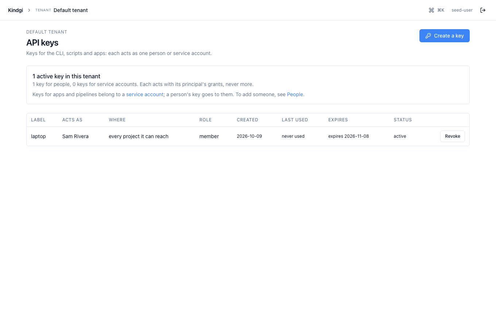
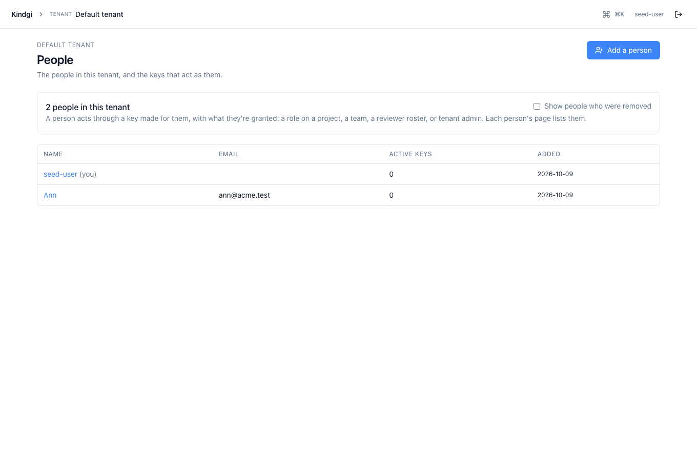
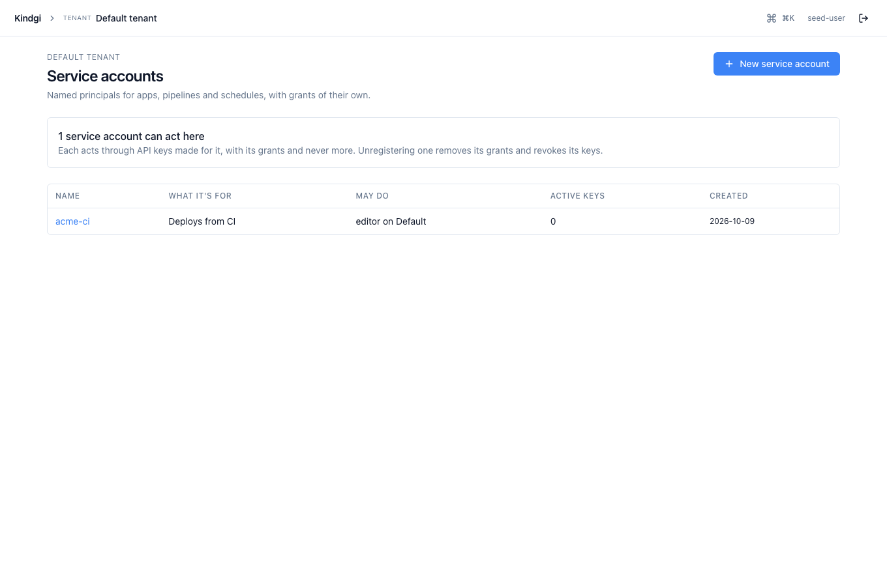

With [authorization](../authorization/) on, a tenant has **people**, each
with their own sign-in and API keys, and **service accounts**, which act for
a pipeline or an app. What each may do is kept in OpenFGA, so turn
authorization on first. A **tenant admin** adds them. The first one is the
runtime's seed user (`KINDGI_SEED_USER_ID`, or the API token's user), whom
the runtime makes a tenant admin at every start.

## Who can do what

- **A tenant admin** does everything in the tenant: adds and removes people,
  makes keys for anyone, and changes tenant-wide settings (providers,
  policies, signing keys, deployments, identity providers).
- **A tenant member** reads the tenant's settings (providers, policies,
  adapters, signing keys, deployments), not its projects. Everyone you add
  is one.
- **A role on a project** (`owner`, `admin`, `editor` or `viewer`) gives the
  work in it: its agents, runs and conversations
  ([Project memberships](../authorization/#project-memberships)).
- **A service account** has only what it's granted. It isn't a tenant member
  unless you make it one.

Lists hold only what the caller may read.

:::caution[One company per tenant]
Everyone in a tenant reads its settings. Give people from different
companies different tenants, not different projects of one tenant.
:::

## Add a person

```sh
kindgi people add --name="Sam Rivera" --email=sam@acme.example
```

It prints the new person, and says on stderr what being added gives them:

```text
{
  "userId": "002ee784-0b05-47fb-918e-34d192be94c1",
  "displayName": "Sam Rivera",
  "email": "sam@acme.example"
}
Added to the tenant: they can read its settings. Give them a project role to work on its agents and runs, then their first key: kindgi tokens create --for=user:002ee784-0b05-47fb-918e-34d192be94c1
```

An email another person already has is refused
(`409 identity-user-email-taken`).

Then give them a role on a project. A tenant admin, or an admin of that
project, adds them by email or by id:

```sh
curl -X POST "$KINDGI_API_URL/v1/projects/<project-id>/memberships" \
  -H "Authorization: Bearer $KINDGI_API_TOKEN" -H 'content-type: application/json' \
  -d '{"email":"sam@acme.example","role":"editor"}'
```

The email matches whatever its case, and the answer names the person. Here a
project admin added a viewer as `GUS@acme.test`:

```json
{"projectId":"ea6e0f95-301e-4017-b2d4-82590cc6ec64","userId":"74e4beb8-6aa4-47ef-9f2a-e0245ee62343","role":"viewer"}
```

Someone who isn't one of the tenant's people (or was removed) isn't added:

```json
{"error":{"code":"identity-user-not-found","message":"No one with email \"outsider@example.com\" is a member of this tenant","requestId":"req-304865e8-9499-48cd-afca-2f8c87e8f05d"}}
```

In the clients: `projects.memberships.add(projectId, { email, role })`
(TypeScript). Now they can [sign in to the console](../sign-in/), or use a
key you make them.

## Make someone a tenant admin

```sh
kindgi people grant <user-id> --tenant-admin
kindgi people ungrant <user-id> --tenant-admin
```

The grant holds from their next request. `kindgi people grants <user-id>
--table` lists what someone holds: tenant admin, tenant member, project and
team roles, and a reviewer role, as granted directly (what a team or an org
gives isn't expanded). Sam, just added, holds only the tenant membership:

```text
WHERE   ROLE
──────  ───────────────────────────
tenant  member (reads its settings)
```

Taking tenant admin away is refused in two cases:

- `409 last-tenant-admin`: they're the only one. Make someone else a tenant
  admin first.
- `409 seed-user-admin`: they're the seed user, whom the runtime makes a
  tenant admin again at every start. Unset `KINDGI_SEED_USER_ID` and restart
  the runtime first.

## What you may do

`GET /v1/identity/me/permissions` answers what you, the caller, may do, with
your API key's limits applied. Unlike `grants`, it counts every way you hold
a role.

- **`tenant`:** `{admin, member}`.
- **`reviewer`:** when you're a reviewer, your role, your reviewer `id` (an
  approval assigned to you names it in `assignedTo`), the approvals' roles you
  may decide (your rank and below), and whether you can decide at all.
- **`key`:** when you call with an API key, its role and the project it's
  limited to.
- **`tokenCapabilities`:** what your token itself carries for secret, env and
  signing-key writes. A sign-in session carries none; an API key carries
  those it was minted with (none by default).
- **`projects`:** each project you may read, with your highest role in it and
  every way you hold one (`via`):
  - `direct`, or through a `team`, with `since` when the runtime keeps it;
  - `org-admin`, as an admin of the org it sits in;
  - `tenant-admin`.
- **`orgs` and `teams`:** your own, with your role in each.
- **`capabilities`:** what each project role allows on the project and on
  each kind of object in it, read from the runtime's authorization model.
  Your project role's entry is what you may do there.
- **`readOnlyNotice`:** the line the console shows someone who may only
  view a project, when a tenant admin set one. It's in the tenant config,
  `kind: 'config'`, key `console.readOnlyNotice`, plain text on one line, at
  most 280 characters.

A key limited to a project sees that project alone. A `member` key is never
a tenant admin. You only see what you may read: no project you can't read,
no one else's role.

The console hides actions by it. The server still checks every call.

On a runtime without an authorization store it answers
`501 permissions-unsupported`. In the clients it's
`client.identity.me.permissions()` (TypeScript and Python).

## API keys

Everyone can make their own keys:

```sh
kindgi tokens create --label=laptop --expires=30d
```

The secret is printed once, there: store it, because nothing shows it again.
`--expires` takes `30d`, `12h`, `90m` or a date; a key without it doesn't
expire.

- **For someone else** (a tenant admin only): `--for=user:<user-id>` or
  `--for=sa:<service-account-id>`.
- **`--role=member`** (the default) takes no admin action on the tenant, even
  for a tenant admin. A project admin's member key still manages that
  project's members. **`--role=admin`** is made only by a tenant admin, and
  only for a tenant admin (`403 role-exceeds-principal` for anyone else).
- **`--project=<project-id>`** limits the key to one project. A request that
  names another project is refused (`403 key-project-mismatch`).

A tenant admin made Sam's first key:

```sh
kindgi tokens create --for=user:<user-id> --label=laptop --expires=30d
```

```text
{
  "meta": {
    "id": "16979e65-a65d-46aa-a348-1b64d1c7d41f",
    "principal": {
      "kind": "user",
      "id": "002ee784-0b05-47fb-918e-34d192be94c1"
    },
    "role": "member",
    "capabilities": [],
    "label": "laptop",
    "createdBy": "user:11111111-3333-4333-8444-000000000402",
    "createdAt": "2026-10-09T12:20:34.217Z",
    "expiresAt": "2026-11-08T12:20:34.178Z"
  },
  "secret": "kgi_ak_…"
}
⚠ The secret of key 16979e65-a65d-46aa-a348-1b64d1c7d41f is shown once, above: store it now.
```

```sh
kindgi tokens list --table
```

```text
ID                                    FOR                                        ROLE    PROJECT  LABEL   CREATED                   EXPIRES                   REVOKED  LAST USED
────────────────────────────────────  ─────────────────────────────────────────  ──────  ───────  ──────  ────────────────────────  ────────────────────────  ───────  ─────────
16979e65-a65d-46aa-a348-1b64d1c7d41f  user:002ee784-0b05-47fb-918e-34d192be94c1  member           laptop  2026-10-09T12:20:34.217Z  2026-11-08T12:20:34.178Z
```

`kindgi tokens list` lists your keys; a tenant admin sees everyone's
(`--for=user:<id>` for one person's). Someone else's key reads as `404`.
`kindgi tokens revoke <token-id>` refuses the key from its next request on,
with `401`.

## Service accounts

A service account is for a pipeline or an app: it has no sign-in, only keys,
and only the grants you give it.

```sh
kindgi service-accounts create acme-ci --description="Deploys from CI" --project=<project-id>:editor
```

```text
{
  "serviceAccountId": "04da5350-4207-4563-a4f9-c3c3463f33cf",
  "name": "acme-ci",
  "description": "Deploys from CI",
  "grants": [
    {
      "kind": "project",
      "projectId": "211244ea-cdac-45e5-be8c-30a3e0bc42f7",
      "role": "editor"
    }
  ],
  "createdBy": "user:11111111-3333-4333-8444-000000000402",
  "createdAt": "2026-10-09T12:20:35.334Z"
}
```

Then make it a key:

```sh
kindgi tokens create --for=sa:<service-account-id> --label=ci --expires=90d
```

Its grants are written before `create` answers, so its first key works at
once. `--tenant-admin`, `--tenant-member` and `--project=<id>:<role>`
(repeatable) are what you can grant, now or later with
`kindgi service-accounts grant` and `ungrant`.

Give `--tenant-member` only to an account whose job reads the tenant's
settings. Without it, such a read is refused, and the refusal says how to
grant it.

`kindgi service-accounts unregister <service-account-id>` takes its grants
away, and its keys stop working.

## Who sees the tenant's people

Only a tenant admin lists them. Anyone else gets:

```json
{"error":{"code":"permission-denied","message":"Only a tenant admin lists the tenant's people","requestId":"req-6f9ecda9-4a1d-4ef4-83a8-c91d5c78e47f"}}
```

A person's record and sessions are for a tenant admin, or that person.

## Remove a person

```sh
kindgi people remove <user-id>
```

```text
{
  "user": {
    "userId": "002ee784-0b05-47fb-918e-34d192be94c1",
    "tenantId": "0b9f4c1e-4444-4a2b-8c3d-000000000402",
    "primaryEmail": "sam@acme.example",
    "displayName": "Sam Rivera",
    "createdAt": "2026-10-09T12:20:33.577Z",
    "unregisteredAt": "2026-10-09T12:20:36.482Z"
  },
  "keysRevoked": 1,
  "sessionsRevoked": 0,
  "grantsRemoved": 1
}
Removed Sam Rivera: 1 key(s) and 0 session(s) revoked, 1 role(s) and membership(s) taken away.
```

In one step, before it answers, their API keys are revoked, their sessions
end, and every grant and membership is taken away. The next request with
Sam's key:

```text
{"error":{"code":"auth-missing","message":"Bearer token is not recognized","requestId":"req-ea8f3a9a-f1df-4365-9f7c-7bab23beea86"}}
```

That's a `401`. Their record stays, so runs, approvals and the audit trail still
say who they were. Adding their email again makes a new person, with nothing
granted.

It's refused for yourself and for the seed user
(`identity-user-unregister-refused`), and for the only tenant admin
(`last-tenant-admin`). Removed people are left out of lists;
`kindgi people list --include-removed` shows them too.

## In the console

- **API keys** lists your keys (a tenant admin's, everyone's). **Create a
  key** makes one for you, or, for a tenant admin, for a person or a service
  account, with its role, project and expiry. The secret shows once, with a
  Copy button.

  
- **People** (tenant admins): **Add a person**, each person's roles in words,
  making or unmaking a tenant admin, a key for them, and removing them.

  
- **Service accounts** (tenant admins): create one with its grants, change
  them, make it a key, unregister it.

  

A project you have no role on shows **No access**, with the projects you can
open.

## Recorded

Each change is kept as evidence: `person-added`, `person-granted`,
`person-ungranted`, `person-unregistered`, `api-key-minted`,
`api-key-revoked`, `service-account-created`, `service-account-granted`,
`service-account-ungranted` and `service-account-unregistered`. A key's
secret is never in one.
