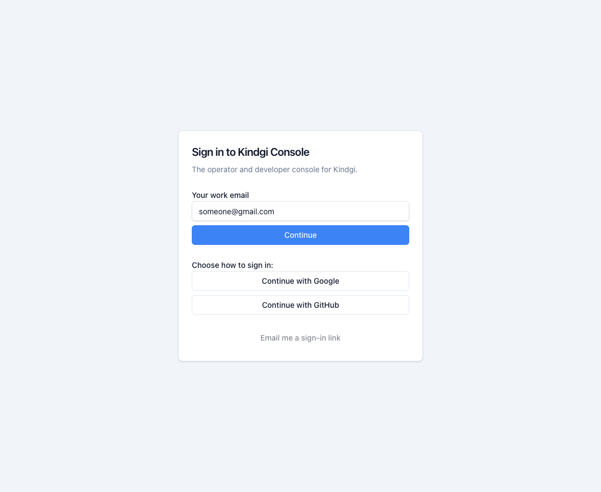
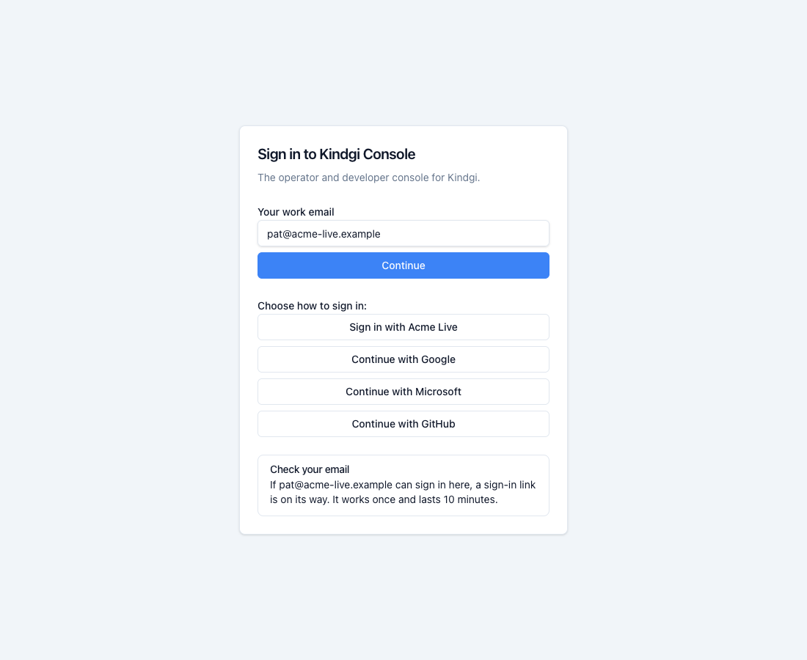
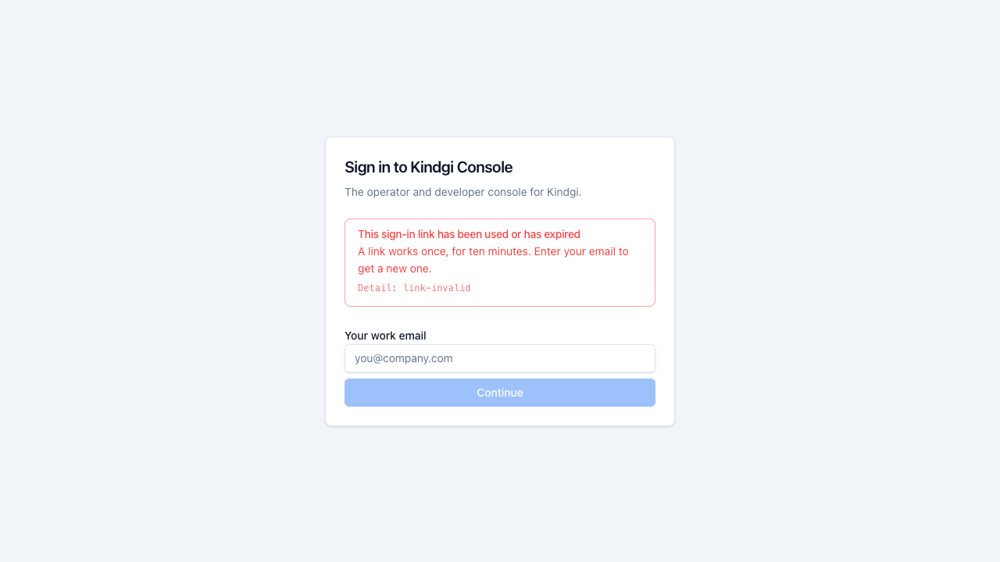

Signing in starts with your email. The console then offers the ways in this
deployment has for it. Which ones it has is up to whoever runs it:
[Turn on sign-in](../../../deploy/sign-in/).

## Your email first

Enter your work email and **Continue**. The page then lists, under **Choose
how to sign in:**

- **Sign in with** your workspace's own identity provider, first, when your
  email's domain is set up for it;
- **Continue with Google** or **Continue with Microsoft**, by who hosts your
  domain's mail (both when that can't be told);
- **Continue with GitHub**, when the deployment has a GitHub app;
- **Email me a sign-in link**, when the deployment sends them.

When your workspace has its own identity provider, it's the way in for your
domain: GitHub and the emailed link aren't offered there.

For a Gmail address, Google and GitHub:

The buttons only point the way. Whichever you choose, you're let in only if
someone has already added you to a workspace, with the email your provider
confirms. If you're in several workspaces, the page asks you to **Choose a
workspace:** (the choice lasts five minutes).

## A sign-in link by email

**Email me a sign-in link** sends a link to your address. The page answers the
same for any email:

The link signs you in to the console. It works
once, for ten minutes. After that:

## When sign-in doesn't let you in

| The page says | What it means |
|---|---|
| Use your work account | Google or Microsoft confirm a work email only through your company's own account. Sign in with that, or another way your workspace offers. |
| Use your company's sign-in | Your workspace signs its people in with its own identity provider. Enter your email again and choose it. |
| You haven't been added here yet | Your sign-in worked, but nobody has added you to this workspace with this email. Ask an admin. |
| Your email isn't verified | Your identity provider says your email isn't verified. Verify it there. |
| No email came back | Your identity provider didn't send your email address. Your admin sets it to send the `email` claim or attribute. |
| You can't sign in here | This sign-in isn't linked to anyone who can use this workspace, for example because you were removed. |
| This is a different account | You used another account than the one you signed in with before, with the same email. Use your usual account. |
| That sign-in option is gone | It may have been removed. Enter your email again. |
| Sign-in was cancelled | Your identity provider didn't let the sign-in through. |
| That sign-in has finished | The choice of workspace lasts five minutes and works once. Sign in again. |
| Too many tries | Wait a minute, then try again. |
| Sign-in didn't complete | Something went wrong between your identity provider and Kindgi. The **Detail** line under it is what your admin needs. |

Each message ends with a **Detail** line, the code your admin can look up.

## With an API token

Where the deployment allows it, the page also has **Your API token**: paste a
token of your own, and it becomes a session. The browser doesn't keep the
token.

A page that says **There's no way to sign in here yet** has no way in turned
on. Ask whoever runs the deployment.

## Next

- [Sessions](../sessions/): how long you stay signed in, and signing out.
- [Set up SSO](../): connect your workspace's own identity provider.
